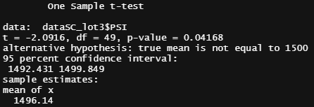

# Challenge 15

## Overview
For this analysis we used R to go over some statistical insights on diferent vehivle parametres.

## Predicting MPG

As we can see with both p-values for ground clearence and vehicle weight are statistically significant since both of them are under 0.05, therefore it accurately predicts the MPG.

## Summary Statistics

Since the p-value is not under 0.05 we can conclude there is not enough evidence to reject the null hypothesis.

### Test on lot 1

### Test on lot 2

### Test on lot 3

## Study design: MechaCar vs Competition
- What metric or metrics are you going to test?
-   Maintenace cost
- What is the null hypothesis or alternative hypothesis?
-   Null: there is no realtion with MPG
-   Alterantive: there is a significant realtionship between them 
- What data is needed to run the statistical test?
-   More data con costs
